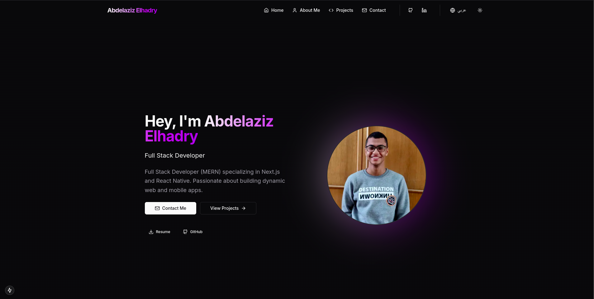

# Modern Portfolio Website

A sleek and dynamic personal portfolio website built with cutting-edge technologies. Showcase your projects, share your story, and connect with visitors through a modern, bilingual interface.



## ✨ Key Features

- **Modern Design** - Elegant UI/UX powered by Tailwind CSS and Shadcn/UI components
- **Dark/Light Themes** - Seamless theme switching for optimal viewing experience
- **Bilingual Support** - Full English and Arabic language support
- **Responsive Layout** - Perfect viewing experience across all devices
- **Performance Optimized** - Server-side rendering and image optimization
- **Smooth Animations** - Polished transitions and interactions using Framer Motion
- **SEO Ready** - Built-in SEO optimization for better visibility

## 🛠️ Tech Stack

- **Framework**: Next.js 15 with App Router
- **Language**: TypeScript
- **Styling**: Tailwind CSS
- **Components**: Shadcn/UI
- **Animations**: Framer Motion
- **Performance**: Next/Image optimization

## 🚀 Getting Started

### Prerequisites

- Node.js (v18 or higher)
- npm, yarn, or pnpm

### Installation

1. Clone the repository:

   ```bash
   git clone <repository-url>
   cd portfolio-website
   ```

2. Install dependencies:

   ```bash
   npm install
   # or
   yarn install
   # or
   pnpm install
   ```

3. Start the development server:

   ```bash
   npm run dev
   # or
   yarn dev
   # or
   pnpm dev
   ```

4. Open [http://localhost:3000](http://localhost:3000) in your browser

## 📁 Project Structure

```
├── app/                  # Next.js app directory
│   ├── _components/      # Shared components
│   ├── _constants/       # Constants and data
│   ├── _contexts/        # React contexts
│   ├── _hooks/          # Custom hooks
│   ├── _locales/        # Translation files
│   ├── _types/          # TypeScript types
│   ├── _utils/          # Utility functions
│   ├── about/          # About page
│   ├── blog/           # Blog page
│   ├── contact/        # Contact page
│   └── projects/       # Projects page
├── components/          # UI components
├── lib/                # Library code
├── public/             # Static assets
└── styles/             # Global styles
```

## 🌐 Deployment

The application can be deployed with a single click through [Vercel](https://vercel.com), the platform created by the makers of Next.js. Other hosting options like Netlify or AWS Amplify are also supported.

## 🎨 Customization

### Theme

Modify the theme in `tailwind.config.js` to match your brand colors and styling preferences.

### Content

Update your personal information and projects in:

- `app/_constants/projects.ts`
- `app/_constants/blogs.ts`
- `app/_constants/certifications.ts`
- `app/_constants/experience.ts`
- `app/_constants/links.ts`
- `app/_constants/skills.ts`
- `app/_constants/metadata.ts`

### Translations

Add or modify translations in the `app/locales` directory.

## 📚 Learn More

- [Next.js Documentation](https://nextjs.org/docs)
- [Tailwind CSS Documentation](https://tailwindcss.com/docs)
- [Framer Motion Documentation](https://www.framer.com/motion/)
- [Shadcn/UI Documentation](https://ui.shadcn.com/)

## 📄 License

This project is licensed under the MIT License.

## 🤝 Contributing

Contributions are welcome! Please feel free to submit a Pull Request.

---

Built with ❤️ using Next.js and modern web technologies.
